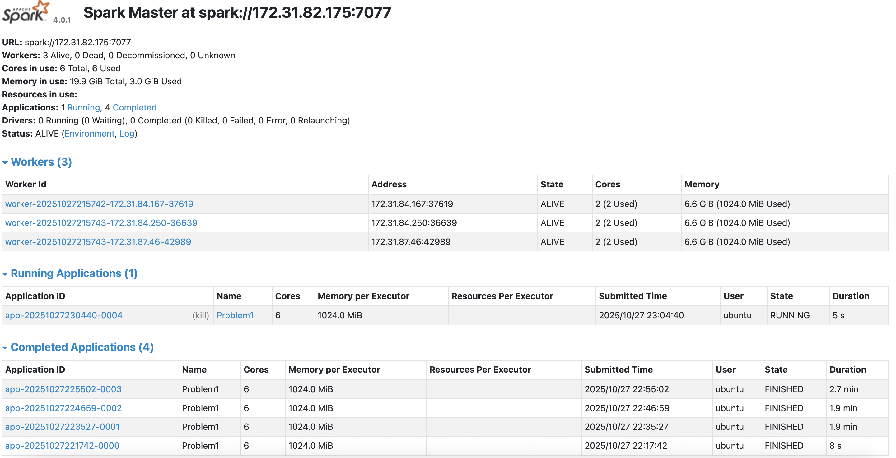
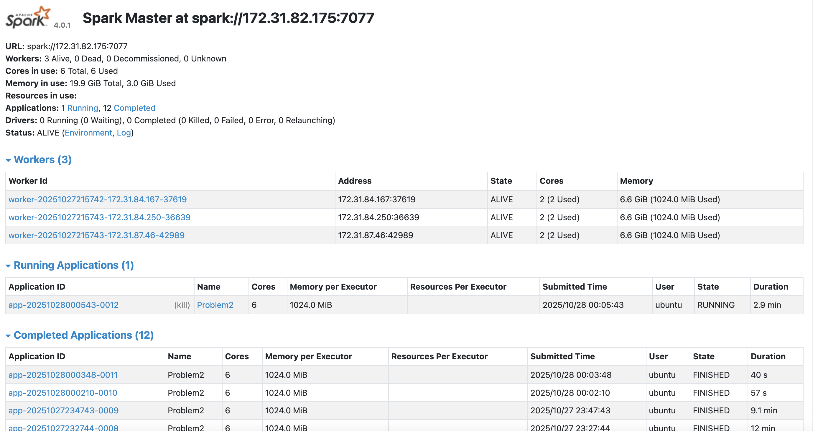

# Analysis Report

## Description of Approach to Problems

For problem 1, my approach was to build off of the code from the previous lab where we setup a spark cluster. I then created a function to create a spark session and a function to save csv files instead of folders as Spark does. Finally, I made a function that read in the log files, got the log level categories using a regex function, and counted the number of logs for each category. I then got 10 samples utilizing a select and orderby function. Finally, I computed the summary statistics and saved all these outputs to CSV using my function.

For problem 2, I took the skeleton of problem 1, resuing the main functions in the script. After reading in the log files, I got the time patterns utilizing a regex function as well as grabbed the timestamps. Then I got the application times by using a filter, groupby, and agg function. I then computed the summary statistics, similar to problem 1. For the bar chart and density plot I utilized matplotlib to create plot of these plots. Finally, I stopped the Spark session and exported the outputs. 

## Key Findings and Insights

Something I found intereseting was a large portion of the log files did not have a log level. In addition, the log files did not contain any debugging files based on the log level counts in problem 1. The master cluster is most heavily used, with the others being hardly utilized. 

## Performance Observations

Overall, the performance of the clusters was good. It was able to process a very large dataset in a realitvely short amount of time. The first problem did complete much more efficiently than the second problem. The problems are able to run on 6 clusters, improving performance.

## Spark Web UI

## Explanation of Problem 2 Visualizations

The first visualization is the bar chart which shows the clusters that are utilized and the number of applications they each perform. We see that there are 6 total clusters being used for problem 2 and that the first cluster ends up performing most of the applications (181), the second one peforms 8 applications, the third performs 2, and the other three each have 1. The second visualization is the distribution of job durations across the 6 clusters for problem 2. The x-axis is the duration of the job in seconds and the y-axis is the density of jobs for each duration increment. The red line through the histogram provides a smooth distribution of the overall trend of job durations. We see that most of the jobs finish relatively quickly in the 10^1 to 10^3 range, while there are a few jobs that take longer than 10^3 and then even fewer jobs as we get into the longer duration zones.  